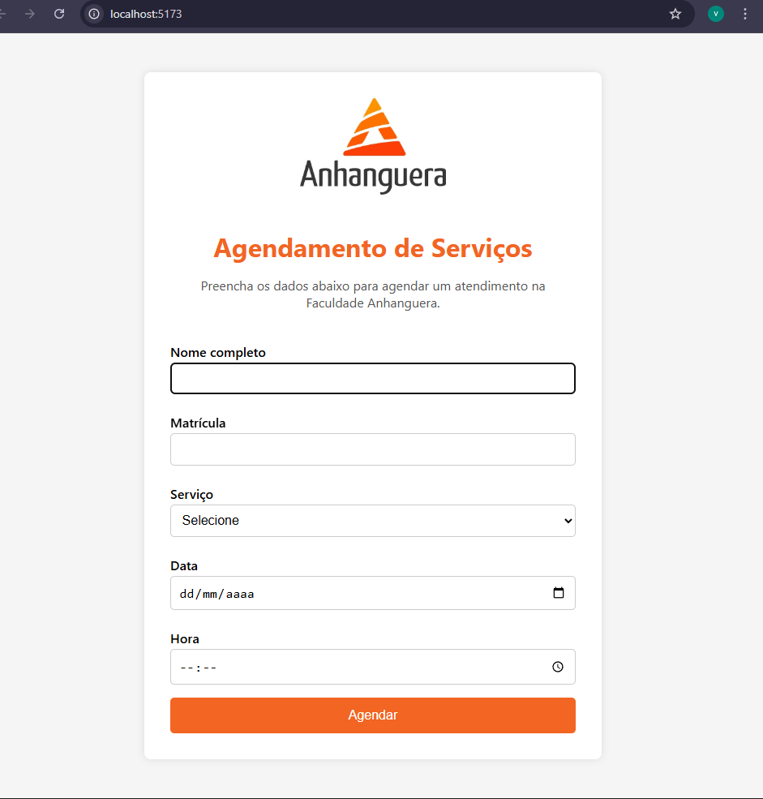

# 📅 Agendamento Faculdade

## 🖼️ Interface do Projeto




Projeto de formulário de agendamento desenvolvido como atividade acadêmica, com foco em organização de horários e prática de desenvolvimento frontend.

---

## 🎯 Objetivo do Projeto

O objetivo deste projeto é permitir o agendamento de horários por meio de um formulário simples e intuitivo, aplicando conceitos aprendidos em sala de aula como:

- Estruturação de páginas web
- Organização de código
- Uso de ferramentas modernas de desenvolvimento

---

## 🛠️ Tecnologias Utilizadas

- HTML
- CSS
- JavaScript
- Vite
- Node.js

---

## 📂 Estrutura do Projeto

```bash
agendamento-faculdade/
├── src/
├── index.html
├── package.json
├── vite.config.ts
└── README.md


▶️ Como executar o projeto

Siga os passos abaixo:

# Instalar as dependências
npm install

# Rodar o projeto em ambiente de desenvolvimento
npm run dev


Após isso, abra o navegador no endereço indicado no terminal.

📚 Contexto Acadêmico

Projeto desenvolvido para fins educacionais, como parte das atividades da faculdade, com foco no aprendizado prático de desenvolvimento web.

👤 Autor

Victor Ventura
Estudante de tecnologia e programação 🚀


---

## 🧠 Por que esse README é bom?
- Linguagem clara
- Organização profissional
- Mostra que é projeto acadêmico (importante!)
- Explica como rodar
- Já serve como portfólio

Isso **já te diferencia** como iniciante.

---

## ✅ PASSO 3 — Salvar, versionar e enviar ao GitHub

No Git Bash:

```bash
git status
git add README.md
git commit -m "adiciona README com descrição do projeto"
git push